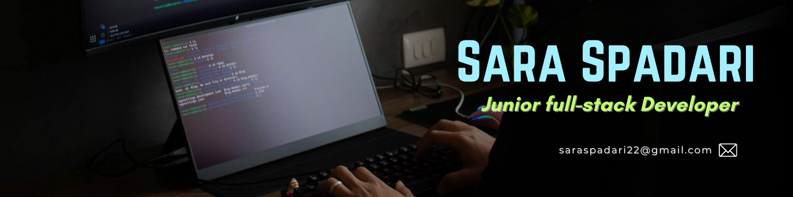

👋 Hi, I’m **Sara Spadari**  
**Junior Full-Stack Web Developer** based in Paris 🇫🇷

I’m a career switcher with a strong focus on building clean, maintainable web applications.  
I enjoy turning complex problems into simple, user-friendly solutions and working in collaborative, product-driven teams.

🔎 Currently looking for **Junior / Entry-Level Web Developer** opportunities.

---

### 🔗 Connect with me

)

---

### ⚙️ Tech Stack

**Frontend**
- HTML5, CSS3, JavaScript (ES6+)
- Responsive Design, UI/UX fundamentals

**Backend**
- Ruby on Rails
- REST APIs, MVC architecture

**Database**
- PostgreSQL, ActiveRecord

**Tools & Workflow**
- Git & GitHub
- Agile / Scrum
- Deployment (Heroku / similar)

---

### 🌱 What I’m working on
- Improving code quality and best practices
- Deepening JavaScript & Rails knowledge
- Building real-world projects to strengthen my portfolio

---

### 🌍 Languages
- Italian (native)
- English (fluent)
- French (fluent)
- Spanish (fluent)
- Portuguese (conversational)

---

📌 *Check out my repositories below to see what I’m working on.*
